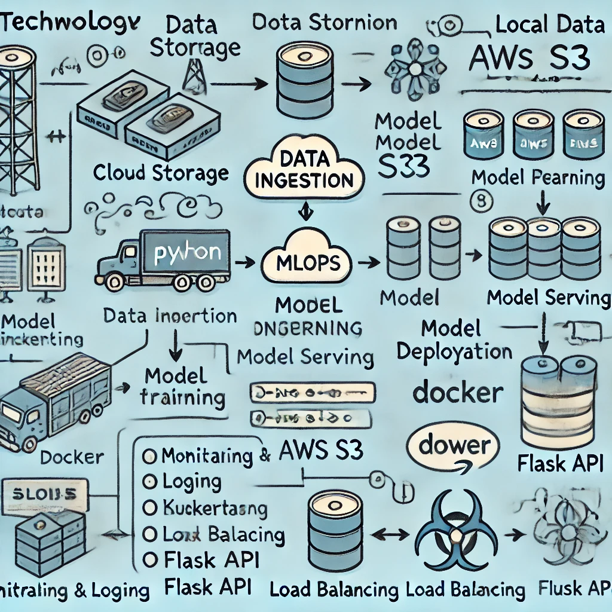

# My-Machine-Learning-Operations (MLOps Platform)

## Overview
This project demonstrates a simple Machine Learning Operations (MLOps) pipeline, including model building, deployment, monitoring, and scaling using a load balancer. It automates the workflow from model training to deployment and offers a REST API to serve predictions.

### Key Features
- Automated **Docker** deployment for the machine learning model.
- **REST API** to serve the ML model.
- Scripts for **monitoring**, **load balancing**, and **deployment** automation.
- **Unit tests** for ensuring code quality.
- Uses **Flask** for serving the API and **Scikit-learn** for the machine learning model.
- Infrastructure setup using **AWS CLI**.



## Project Structure
```
mlops-platform/
│
├── api/
│   └── serve_model.py          # REST API to serve the ML model
│
├── ml_models/
│   └── model.py                # Simple ML model with training and prediction
│
├── infra/
│   └── infra_setup.py          # Infrastructure setup script (e.g., AWS S3)
│
├── scripts/
│   ├── deploy_model.sh         # Script to deploy the model via Docker
│   ├── monitor.sh              # Script to monitor the system and container
│   └── load_balancer_setup.sh  # Script to set up load balancer (AWS example)
│
├── tests/
│   └── test_model.py           # Unit tests for ML model and API
│
├── Dockerfile                  # Docker image configuration
├── requirements.txt            # Python dependencies
├── README.md                   # Project documentation
└── .gitignore                  # Ignore files
```

## Prerequisites
- Python 3.9+
- Docker
- AWS CLI (optional, if using AWS for load balancing or infrastructure)
- `curl` or **Postman** to test the API

## Setup Instructions

### 1. Clone the Repository
```bash
git clone https://github.com/JUnelus/My-Machine-Learning-Operations.git
cd My-Machine-Learning-Operations
```

### 2. Set Up Python Virtual Environment
```bash
python3 -m venv venv
source venv/bin/activate  # On Windows: venv\Scripts\activate
```

### 3. Install Dependencies
Install the necessary Python packages:
```bash
pip install -r requirements.txt
```

### 4. Build the Docker Image
Build the Docker image to package the model and API:
```bash
docker build -t mlops-platform .
```

### 5. Run the Docker Container
To start the API inside the Docker container:
```bash
docker run -p 5000:5000 mlops-platform
```
The API will now be accessible at `http://localhost:5000`.

### 6. Test the API
Use `curl` or **Postman** to send a POST request to the `/predict` endpoint with some input data:

```bash
curl -X POST http://localhost:5000/predict -H "Content-Type: application/json" -d '{"input": [[0, 0], [1, 1]]}'
```

**Expected Response**:
```json
{
  "prediction": [0, 1]
}
```

### 7. Run Unit Tests
To ensure the model and API are functioning correctly, run the unit tests:
```bash
python -m unittest tests/test_model.py
```

### 8. Monitoring the System
To monitor the Docker container and system performance:
```bash
./scripts/monitor.sh
```

### 9. Set Up Load Balancer (Optional)
To set up a load balancer (example uses AWS):
```bash
./scripts/load_balancer_setup.sh
```

### 10. Deploy the Model
To automate the deployment of the model, use the deployment script:
```bash
./scripts/deploy_model.sh
```

## Project Features in Detail

### Model Training and Deployment
- The `ml_models/model.py` contains a simple machine learning model implemented with `Scikit-learn`.
- The model is trained with dummy data on startup and served via a REST API using `Flask`.

### Docker for Deployment
- The project uses Docker for packaging the model and the API into a containerized environment.
- The `deploy_model.sh` script automates the process of building the Docker image and running the container.

### Monitoring and Load Balancing
- The `monitor.sh` script provides a basic way to track system performance (CPU, memory) and view logs from the Docker container.
- The `load_balancer_setup.sh` script provides an example of setting up an AWS load balancer to distribute traffic across multiple instances of the API.